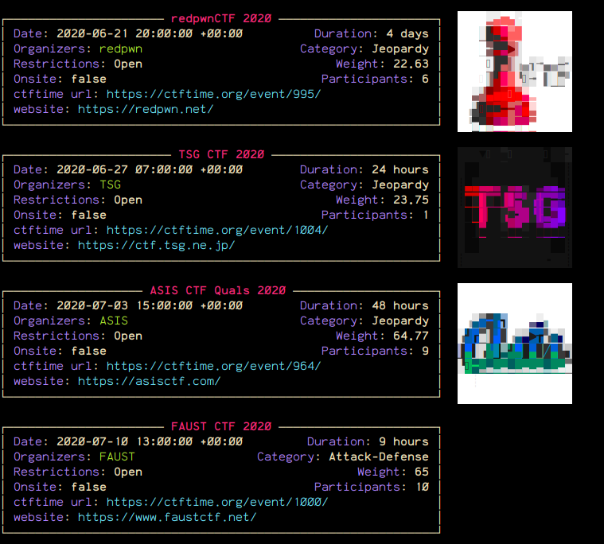

# Ctfwatch

Tired of going on [ctftime.org](https://ctftime.org) to check the upcoming ctfs?

No worries, now you can do it directly from your terminal!

Just `curl ctf.watch` or host your own by cloning this repo!

# Instructions

- `docker build -t ctfwatch .`

- `bash run.sh`

# Credits

Data pulled from ctftime.org

Thanks to @jonasbb's [ctftimebot](https://github.com/jonasbb/ctftimebot) for inspiration!
